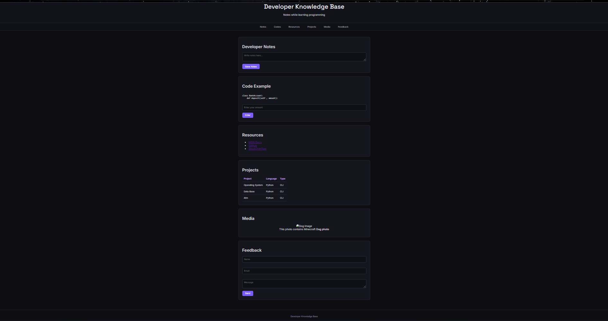

# Project

These files include simple examples and experiments created such as forms, tables, and text structure.

---

## Screenshots

### UI PREVIEW

## Topics Covered

### Text Structure

Basic elements used to organize content on a webpage.

Examples practiced:

* Headings (`h1` – `h6`)
* Paragraphs (`p`)
* Lists (`ul`, `ol`, `li`)
* Links (`a`)

### Tables

Learning how tabular data is structured in HTML.

Concepts used:

* `<table>`
* `<tr>` (table row)
* `<th>` (table header)
* `<td>` (table data)
* `<thead>` and `<tbody>`

These elements help organize structured information like schedules, data records, or reports.

### Forms and Inputs

Basic user input elements used to collect information from users.

Examples included:

* Text input fields
* Email inputs
* Number inputs
* Textareas
* Buttons
* Basic form structure using `<form>`

Forms are commonly used for login systems, feedback forms, and data submission.

### Media and Content

Basic media elements used to display images and structured content.

Examples include:

* ``
* `<figure>`
* `<figcaption>`

---

## Purpose

This directory is part of my **web development learning journey**.
It focuses on understanding how raw HTML works before adding advanced styling or JavaScript functionality.

The exercises here help build a solid foundation for frontend development.

---