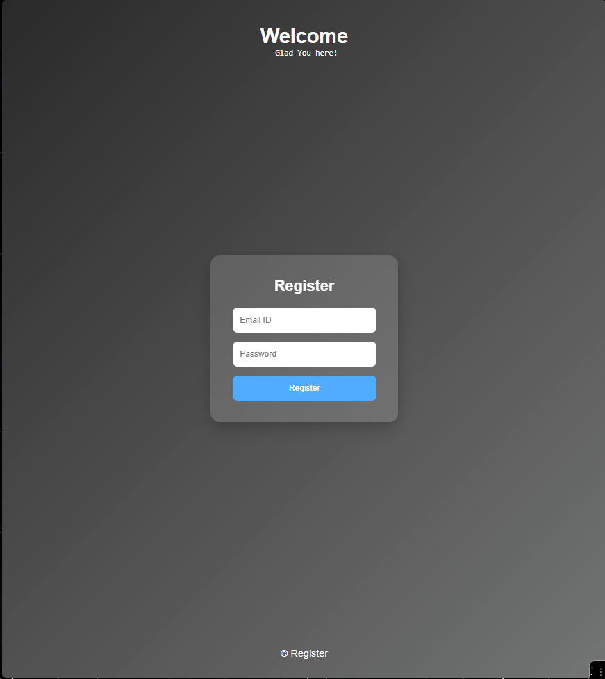
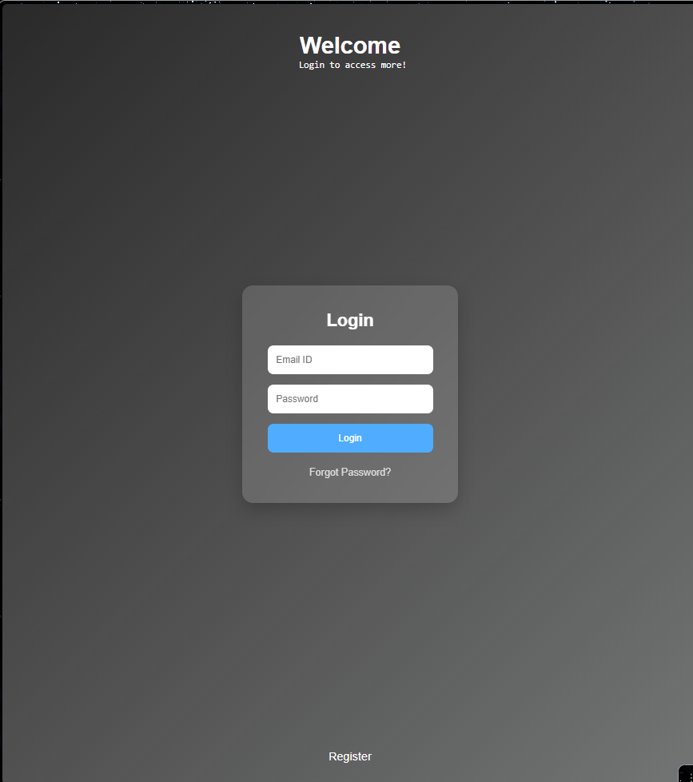
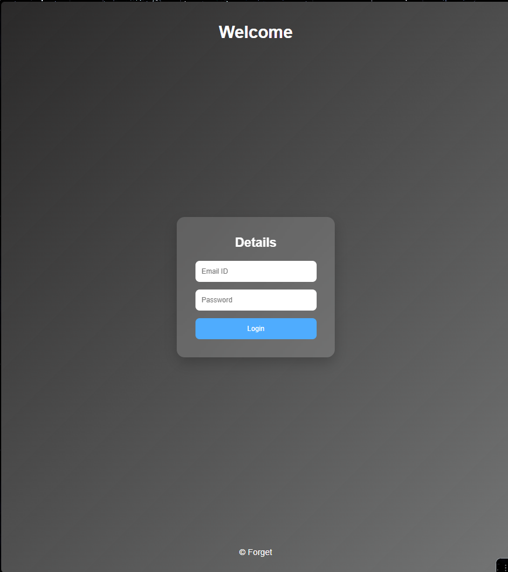

# Login Page UI (HTML + CSS)

A simple and modern **Login Page UI** built using only **HTML and CSS**.
This project focuses on improving frontend layout skills, form styling, and modern UI design techniques without using any frameworks.

---

## ✨ Features

* Clean login interface
* Email and password input fields
* Styled login button with hover effect
* "Forgot Password" link
* Modern card layout
* Gradient background
* Glassmorphism style login container

---

## Screenshots

### UI PREVIEW

### Register PREVIEW

### Forget PREVIEW

## 🛠 Technologies Used

* **HTML5**
* **CSS3**
* Flexbox for layout
* CSS transitions for button hover effects

---

## 🎯 Learning Goals

This project was created to practice:

* Structuring pages with semantic HTML
* Centering layouts using **Flexbox**
* Creating modern UI cards
* Styling forms and inputs
* Working with gradients and shadows
* Improving spacing and visual hierarchy

---

---

## 🚀 How to Run

1. Download or clone the repository
2. Open the project folder
3. Run **index.html** in your browser

---

## 📸 Preview

Login page interface with a centered glass-style card containing:

* Email input
* Password input
* Login button
* Forgot password link

---

## 📌 Future Improvements

Possible upgrades for this project:

* Add a **Register page**
* Add **show/hide password toggle**
* Add **responsive mobile design**
* Add **form validation with JavaScript**

---

## 👨‍💻 Author
Dhruv

Created as part of a **Web Development learning journey** to improve UI building skills using pure HTML and CSS.
